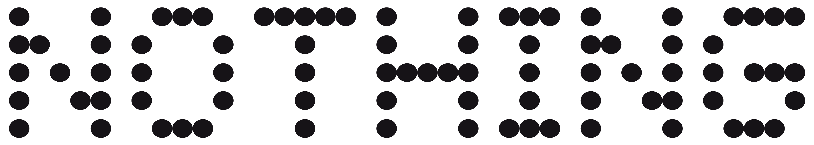

:iphone: [Google Pixel 6a (bluejay)](google/bluejay.md)

:iphone: [Google Pixel 6 (oriole)](google/oriole.md)

:iphone: [Google Pixel 6 Pro (raven)](google/raven.md)

----

:iphone: [Poco F3/K40/Mi 11X (alioth/aliothin)](mi/alioth.md)

:iphone: [Poco F5, Redmi Note 12 Turbo (marble)](mi/marble.md)

:iphone: [Poco X4 PRO / Redmi Note 11 PRO PLUS 5G (veux/peux)](mi/veux.md)

:iphone: [Redmi Note 5 Pro (whyred)](mi/whyred.md)

:iphone: [Redmi Note 10 PRO  (sweet)](mi/sweet.md)

:iphone: [Redmi Note 11 (spes)](mi/spes.md)

:iphone: [Redmi 6 Pro (sakura)](mi/sakura.md)

----

:iphone: [Motorola G32 (devon)](motorola/devon.md)

:iphone: [Motorola G42 (hawao)](motorola/hawao.md)

:iphone: [Motorola G52 (rhode)](motorola/rhode.md)

----

:iphone: [Nothing Phone (1) (spacewar)](nothing/spacewar.md)

----

:iphone: [OnePlus 7t (hotdogb)](oneplus/hotdogb.md)
 
:iphone: [OnePlus 7t Pro (hotdog)](oneplus/hotdog.md)

:iphone: [OnePlus 8 (instantnoodle)](oneplus/instantnoodle.md)

:iphone: [OnePlus 8 Pro (instantnoodlep)](oneplus/instantnoodlep.md)

:iphone: [OnePlus 8T (kebab)](oneplus/kebab.md)

:iphone: [OnePlus 9 (lemonade)](oneplus/lemonade.md)

:iphone: [OnePlus 9 Pro (lemonadep)](oneplus/lemonadep.md)

:iphone: [OnePlus 9RT (martini)](oneplus/martini.md)

----

:iphone: [Realme X50 Pro/Player 5G (bladerunner)](realme/bladerunner.md)

:iphone: [Realme C3/N10A (RMX2020)](realme/RMX2020.md)

----

:iphone: [Samsung A70 (a70q)](Samsung/a70q.md)

----

[Back](./)
